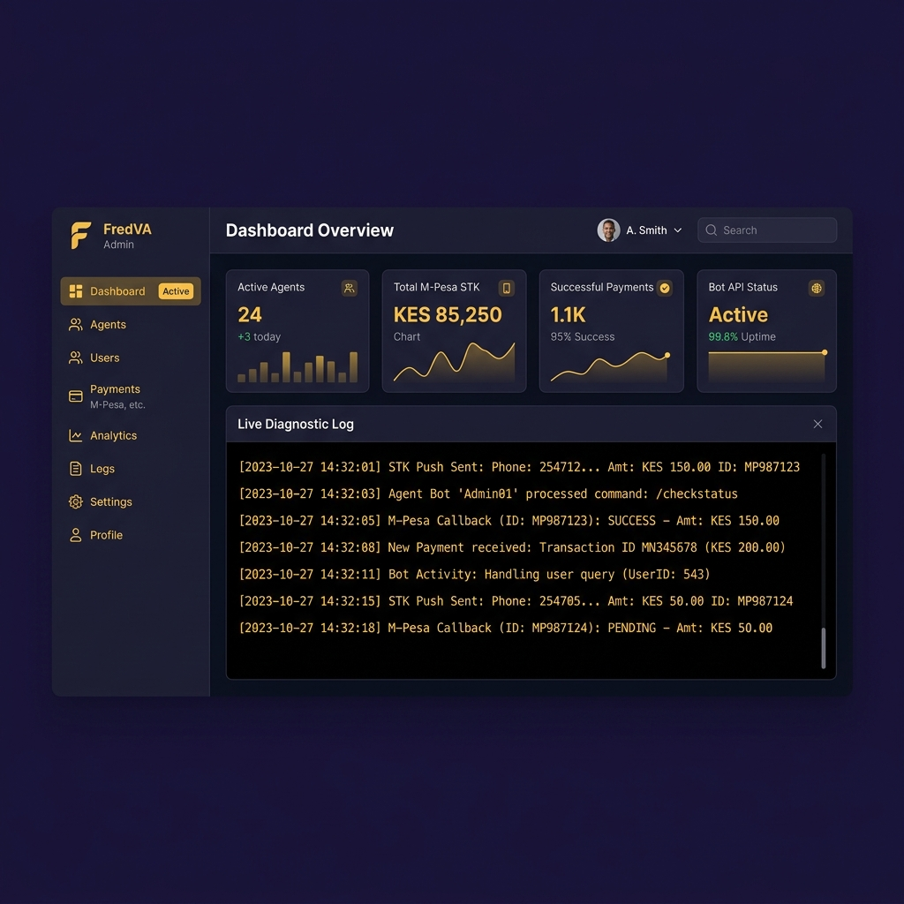

# FredVA Admin Dashboard & Outbound Control Suite

Hey there! 👋 This is the custom control dashboard for my **FredVA (Fred Virtual Assistant)** automation bot. As a freelance developer based in Nairobi, doing manual outbound lead generation and following up with local clients for payments was taking up too much of my coding time. I built this dashboard to monitor and control my helper bot.

It handles outbound lead generation, cold emailing campaigns, Safaricom Lipa na M-Pesa STK push checkouts, and system health checks all in one visual workspace.



## What it does

1. **Lead Scraper Engine:** Scrapes local Kenyan business contacts (emails, phone numbers, locations) based on target sectors (e.g., Tech Startups, Lodges, Salons).
2. **Cold Email Broadcast:** Launches automated cold email pitches (M-Pesa STK integration proposals, SEO audits) to scraped leads with a live delivery success log.
3. **M-Pesa STK Sandbox Audit:** A payment audit system connected to Safaricom's Daraja API sandbox, letting me trigger test STK push prompts directly to my phone for client fee deposits.
4. **SSH Terminal Emulator:** A retro-themed interactive command-line interface for direct server control. Run commands like `status`, `scrape`, `email`, or `mpesa` right in the browser.

## The Design

I chose a **Royal Velvet & Solar Gold** dark high-contrast palette (`#0f0a1c` base and warm `#f59e0b` amber highlights) with **Plus Jakarta Sans** and **Fira Code** for monospace terminal consoles. It moves away from generic glassmorphism templates, focusing on dense widgets and utility diagnostics that feel like a real developer tool.

## Tech Stack

- **Framework:** Next.js (React + TypeScript Pages Router)
- **Styling:** Tailwind CSS CDN / Native Utilities
- **API integrations:** Safaricom Daraja STK Push webhooks
- **Icons:** Font Awesome 6.4.0

## Getting Started

To run the Next.js development server locally:

```bash
npm install
npm run dev
```

Open [http://localhost:3000](http://localhost:3000) in your browser.

*Built with 💻, ☕, and Safaricom API tokens in Nairobi.*
